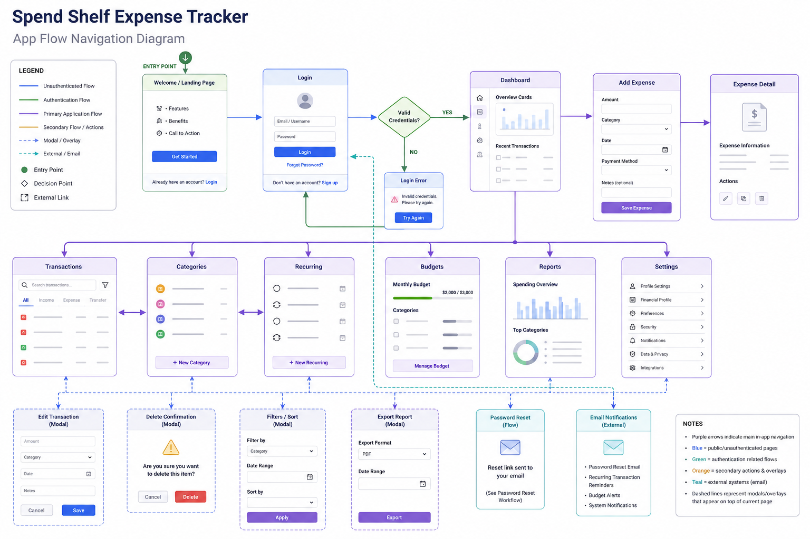

# Django Expense Tracker (Spend Shelf)

Spend Shelf is a Django-based personal expense tracker with dashboards, analysis, recurring transactions, CSV import/export, and PDF analysis export.

Key features include:
- Authentication (signup/login/logout)
- Expense CRUD (create, read, update, delete)
- Financial profile (savings, salary, monthly budget)
- Dashboard with 6-month trend chart and personalized greeting
- Data Analysis page with multiple statistical measures and trend projection
- Budget alerts and usage insights
- Recurring transactions processing
- CSV import/export and monthly report generation

## AppFlow



## Features (Extended)

The application includes the following detailed capabilities:

- Authentication and onboarding
	- User registration, login, logout using Django auth.
	- Per-user data isolation: categories, expenses, and profiles are scoped to the logged-in user.

- Dashboard
	- Current month total, lifetime spend, and recent expenses list.
	- 6-month trend chart (Chart.js) with responsive layout.
	- Budget alerts and budget usage percentage computed from the user's financial profile.

- Expense management
	- Create, edit, and delete expenses; each expense belongs to a category.
	- Category creation and management from the Personalize page.

- Financial profile
	- Edit current savings, monthly salary, and monthly budget on the Personalize page.
	- Dashboard uses these values for alerts and insights (salary spend ratio, budget used).

- Recurring transactions
	- Create weekly or monthly recurring transactions; mark active/inactive.
	- Manual processing endpoint to generate due expense rows from recurring items.

- Data Analysis
	- Analysis options include: overview, median, standard deviation, month-over-month change, category variance, and trend projection.
	- Custom date-range analysis (default: latest 12 months) with exports to PDF via ReportLab.
	- Statistical measures: total, average, median, standard deviation, and projection using linear regression.

- Reports and exports
	- Monthly reports with category breakdown and CSV export of all spending.
	- PDF generation for analysis reports (uses ReportLab and Matplotlib image rendering).

- Imports
	- CSV import with basic validation (required headers: date,title,category,amount).

- UI and usability
	- Personalize page merges category setup, recurring transactions, and financial profile into a single management view.
	- Toggle-reveal panels and modal-style cards for focused edits (backdrop, close controls, escape/backdrop-to-close behavior).
	- Icon-only profile link in the top navigation leading to `/profile/`.

## Quick Start (local development)

Prerequisites: Python 3.10+ recommended.

1. Create and activate a virtual environment:

```bash
python -m venv env
# Windows
env\Scripts\activate
# macOS / Linux
source env/bin/activate
```

2. Install dependencies:

```bash
pip install -r requirements.txt
```

3. Apply migrations:

```bash
python manage.py migrate
```

4. (Optional) Create a superuser:

```bash
python manage.py createsuperuser
```

5. Run the development server:

```bash
python manage.py runserver
```

6. Open http://127.0.0.1:8000/ and sign in.

## Important notes

- The app exposes a `/profile/` page where users can edit their name and email. The top navigation contains an icon linking to that page.
- PDF analysis export uses ReportLab and Matplotlib (server-side rendering). If you see errors involving `reportlab` or Matplotlib backends, ensure `reportlab` is installed and Matplotlib uses a non-interactive backend (the code sets `Agg`).
- Virtualenv folders (`env/`, `env1/`) may exist in the repository root; you can delete them if you manage environments elsewhere.

## Deployment (Render / Heroku-like)

Set environment variables in your deployment platform:

- `DJANGO_SECRET_KEY` (required)
- `DJANGO_DEBUG=False`
- `DJANGO_ALLOWED_HOSTS` (your domain)
- `DATABASE_URL` (Postgres URL if using Postgres)

Typical deploy steps (ensure `pip install -r requirements.txt` runs during build):

```bash
python manage.py migrate
python manage.py collectstatic --noinput
```

Procfile (example):

```
web: gunicorn expense_tracker.wsgi --log-file -
```

## Screenshots

## Routes / Pages

- `/signup/` — registration
- `/login/` — login
- `/` — dashboard (shows personalized greeting if user has a name)
- `/expenses/` — list expenses
- `/expenses/add/` — add expense
- `/analysis/` — spending statistics, category analysis, and trend projection
- `/profile/` — edit name and email (user profile)
- `/recurring/` — personalize (categories, recurring transactions, financial profile)
- `/imports/csv/` — import expenses from CSV
- `/exports/spending.csv` — download CSV export of spending
- `/analysis/export/pdf/` — export analysis PDF
- `/reports/monthly/` — monthly reports
- `/admin/` — Django admin

## Troubleshooting

- If charts or PDF exports fail with Matplotlib errors about the main loop, ensure Matplotlib uses the `Agg` backend. The project already configures this, but system-wide Matplotlib configs can interfere.
- If ReportLab is missing, install it:

```bash
pip install reportlab
```


